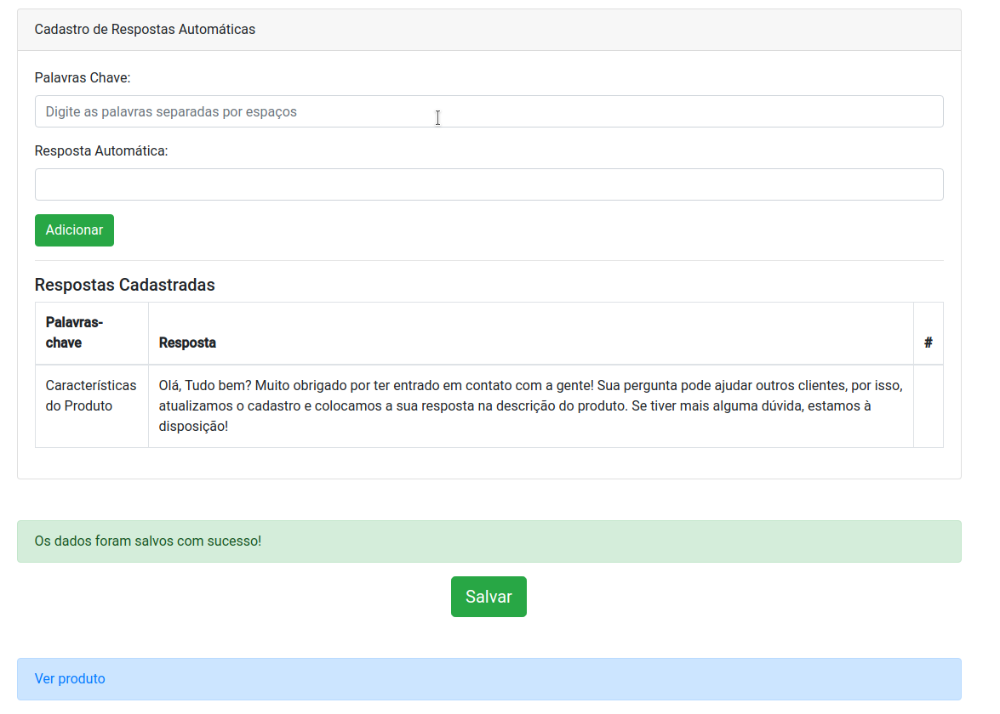

# Projeto MegaHack 2.0

```
Projeto desenvolvido no MegaHack 2.0
```

## Desafio Olist
- Melhorar a experiência de consumo a informação do produto;
- Facilitar a tomada de decisão na hora da compra;
- Proporcionar ao vendedor uma gestão mais fluída e otimizada;

## Solução
- Padronizar a descrição dos produtos para facilitar o entendimento dos clientes;
- Dar respostas automáticas com base nas características do produto;
- Incentivar os vendedores a manter os produtos atualizados através de bonificações;

**Protótipo** : [veja aqui](https://https://lucasheber.github.io/olist-project/)

## Screenshots

## Cadastro de produto


## Respostas automáticas



## Perguntas

